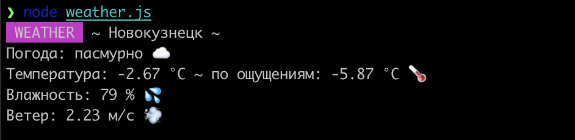

# weather-cli
Simple CLI weather app

- Get token from https://openweathermap.org/
- npm i -g weather-cli
- Set token with -t [API_KEY]
- Set city with -s [CITY]
- Then run weather in console

But you can't do that because the repository is not in npm
